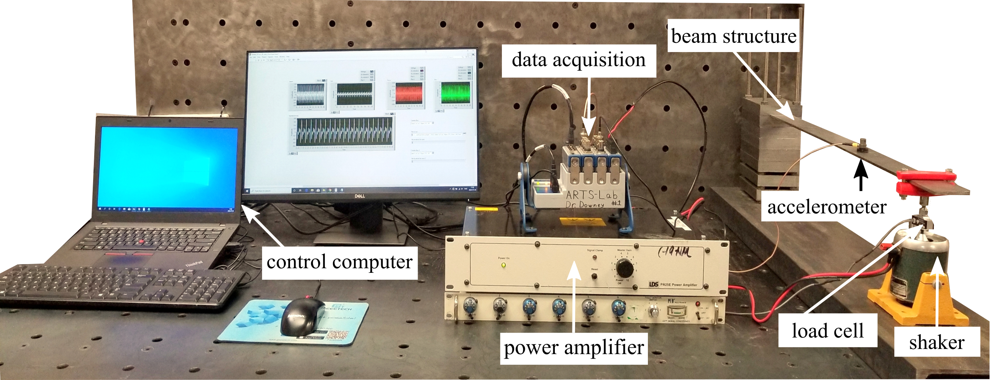

# Producing-data-from-the-cantilever-beam
This repository is regarding generating data from the excitation of the cantilever beam.

## TEST BENCH &amp; TRAINING DATA

Figure 1: Experimental setup of a cantilever beam with key components and data acquisition setup.

<table class="tg">
<thead>
  <tr>
    <th class="tg-7btt" colspan="2">component&nbsp;&nbsp;&nbsp;list for experiment</th>
  </tr>
</thead>
<tbody>
  <tr>
    <td class="tg-uzvj" rowspan="4">hardware</td>
    <td class="tg-0pky">Integral Electronics   Piezoelectric (IEPE) accelerometer (model J352C33 manufactured by PCB   Piezotronics)</td>
  </tr>
  <tr>
    <td class="tg-0pky">electromagnetic   shaker (model V203R manufactured by LDS)</td>
  </tr>
  <tr>
    <td class="tg-0pky">power&nbsp;&nbsp;&nbsp;amplifier (model PA25E-CE manufactured by LDS)</td>
  </tr>
  <tr>
    <td class="tg-0pky">45&nbsp;&nbsp;&nbsp;N load cell (model MLP-10 manufactured by Transducer Techniques) </td>
  </tr>
  <tr>
    <td class="tg-7btt">beam&nbsp;&nbsp;&nbsp;dimensions</td>
    <td class="tg-0pky">steel cantilever beam,  759x 50.66 x 5.14 mm </td>
  </tr>
  <tr>
    <td class="tg-uzvj" rowspan="5">DAQ&nbsp;&nbsp;&nbsp;system</td>
    <td class="tg-0pky">NI-9263  4-Channel (voltage output module)</td>
  </tr>
  <tr>
    <td class="tg-0pky">NI-9239&nbsp;&nbsp;&nbsp;4-Channel (voltage input module)</td>
  </tr>
  <tr>
    <td class="tg-0pky">NI-9237&nbsp;&nbsp;&nbsp;4-Channel (loadcell as Bridge Analog Input)</td>
  </tr>
  <tr>
    <td class="tg-0pky">NI-9234&nbsp;&nbsp;&nbsp;4-Channel (vibration Input Module )</td>
  </tr>
  <tr>
    <td class="tg-0pky">cDAQ-9174&nbsp;&nbsp;&nbsp;4-Slot</td>
  </tr>
</tbody>
</table>

Cite this data as:

Puja Chowdhury, Austin Downey, Jason D. Bakos and Philip Conrad, “Dataset-4-univariate-signal-with-nonstationarity,”
Apr. 2021. [Online]. Available: https://github.com/High-Rate-SHM-Working-Group/Dataset-4-Univariate-signal-with-non-stationarity

@Misc{Chowdhury2021Dataset4Univariate,  
  author = {Puja Chowdhury and Austin Downey and Jason D. Bakos and Philip Conrad},  
  month  = apr,  
  title  = {Dataset-4-Univariate-signal-with-non-stationarity},  
  year   = {2021},  
  groups = {High-Rate-SHM-Working-Group},  
  url    = {https://github.com/High-Rate-SHM-Working-Group/Dataset-4-Univariate-signal-with-non-stationarity},  
}  

